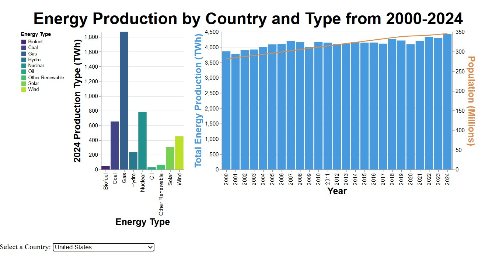

## Portfolio

---

### Data Science Projects 

[Visualizing Renewable Energy Share by Country](/visualizations.md) 

Used 2000-2025 renewable energy share data from [Kaggle](https://www.kaggle.com/datasets/elvisbui/renewable-energy-share-by-country-2000-2025) to build informative and eye-catching visualizations using a variety of python libraries such as pywaffle, altair, and matplotlib. Highlights of this project include:
  - Use of pandas to load, clean, and transform data for visualization
  - Implementing [interactive visualizations](/country_energy_split.html) via altair and static charts via matplotlib

 

---
[Understanding Trends in U.S. Maternal Outcome Measurements (M.O.M.)](/momproject.md) 

Used maternal health indicator data from [Kaggle](https://www.kaggle.com/datasets/neharana404/maternal-indicators-in-us-states2016-2021) to develop a generalized linear model with number of maternal deaths/100k as the response in order to explore the statistical significance of the collected health indicators. Highlights of this project include:
  - K-means clustering to identify outliers
  - K-Nearest-Neighbors imputation for missing values handling
  - Generalized Linear Modeling (Poisson Regression) to see statistical significance of data features with regards to increased counts of maternal mortality

---
[Building a Deep Learning Algorithm to Predict an Article's Topic](/dlaproject.md) 

Used 200k news headlines from Huffpost collected from 2012 to 2018 to train a deep learning model to recognize "health and wellness" articles and predict whether new articles fell into the same category. The highlights of this project include:
  - Succesful use of ktrain from Tensorflow to build and train a model to recognize "health and wellness" articles
  - Exploration of bias/variance trade-off using different splits of training datasets
  - Final reported accuracy (correct predictions from total predictions) of **88%**, with recall (true positives as percentage of all positives) of **93%**

---

Page template forked from <a href="https://github.com/evanca/quick-portfolio">evanca</a>

<!-- Remove above link if you don't want to attibute -->
