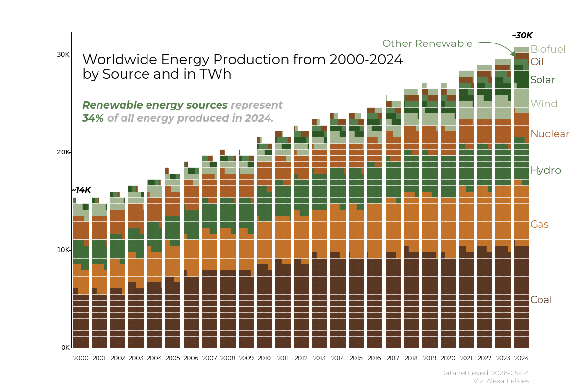
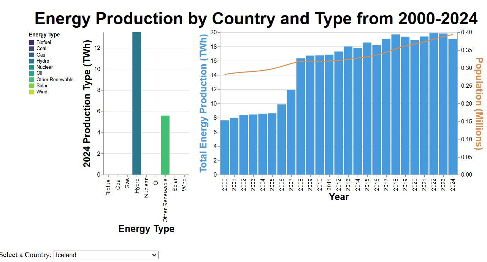
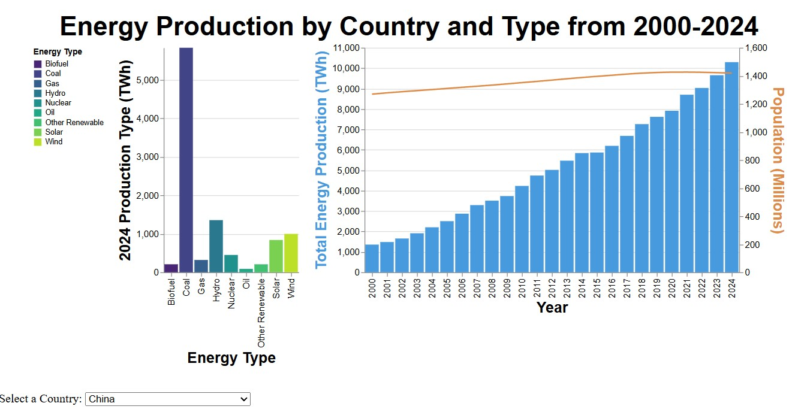

## Visualizing Worldwide Energy Production Data from 2000-2024

**Project Description:** Worldwide energy production and consumption data year over year can be presented visually in multiple interesting and informative ways. The aim of this project is to tell a story with the data in visually pleasing charts and display skills in matplotlib and altair while doing so.

**Data Summary**: This [Kaggle](https://www.kaggle.com/datasets/elvisbui/renewable-energy-share-by-country-2000-2025) dataset contains energy production/consumption in TWh, population, and GDP for 309 countries and regions from 2000-2025. As much of the 2025 data is unpopulated or incomplete, the analysis and visualization was kept to 2000-2024. 

### Creating a Waffle Chart to Visualize Total Energy Production from 2000 to 2024

This visualization uses pywaffle, a library that partners with matplotlib to create waffle charts, which can help guide the human eye to more easily compare values from multiple categories and are generally more eye-catching than traditional stacked bar charts. While these graphs tend to shine with 3-4 categories, I thought to first look at what the chart looked like with all 9 categories of energy production from this data. 

 [Code](/waffle.md)

Based on this chart, we can quickly see that the overall production of energy from all countries in the dataset has almost doubled in the last 25 years. One question we might take away from this is: how do individual countries contribute to this total? 

### Creating an Interactive Bar Chart to Show a Specific Country's Contribution to 2024 Energy Production

This visualization uses altair to create an [interactive bar chart](/interactive.md) that lets the user view both the 2000-2024 trend for a specific country and that country's 2024 energy production mix. A line graph also lets us see at a glance whether the energy production increase over time is a function of population growth. Below is an example of one country selected from the mix:

  [Code](/interactive.md)

These charts let us quickly view and compare different countries. We can see that some countries, like Iceland, have doubled their production while relying solely on renewable sources in 2024. This can help the user explore how each country contributes to the overall energy production mix and drive additional questions for exploration, such as, what could have driven the increased energy production in China if population increase has been relatively flat?
